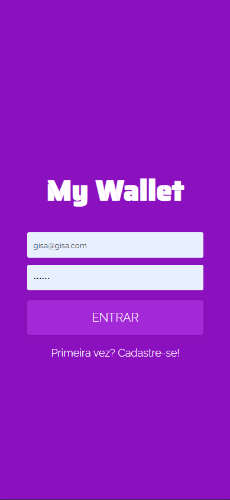
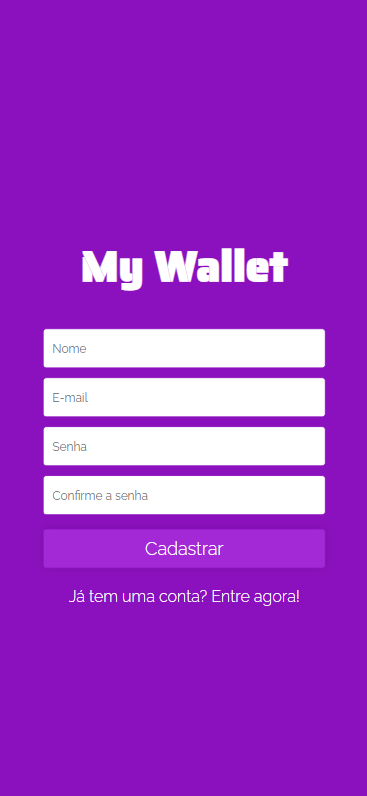
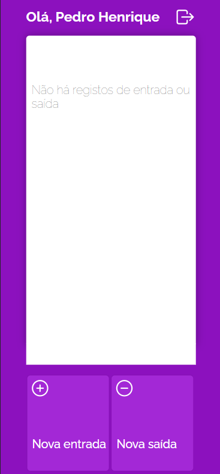
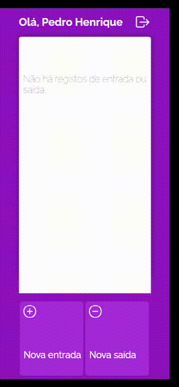
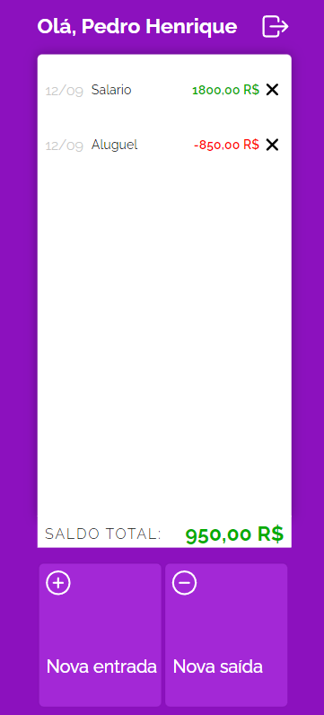

Organize as suas movimentações financeiras com MyWallet - usando ReactJS - NodeJS - MongoDB.

## Tecnologias 
Algumas tecnologias usadas:

* ReactJS
* NodeJS
* MongoDB
* React Router dom, Styled Components, Axios, Joi...

## Serviços
* Github
* Vercel
* Mongo Atlas
* Heroku
  
## Como usar?
### 1 - Quando você acessa, essa é a Tela Inicial.

        
        
        <h4><strong>Obs:</strong> Tela de Login | Tela de Cadastro</h4>

 

### 2 - Logando na plataforma.

 

### 3 - Adicione uma entrada/saída de dinheiro.

    

 

### 4 - Controle e gerencie os seus gastos pelo extrato de movimentações. ❤

## Recursos
  - Layout Mobile 📱
  - Criar uma conta no Aplicativo ✨
  - Adicionar Entrada/Saída de valores da sua conta 📟
  - Deletar ordem do extrato **(Em desenvolvimento ⏳)**
  - Editar ordem do extrato **(Em desenvolvimento ⏳)**
  
## Links
  - Deploy Vercel: ***https://my-wallet-front-mu-orpin.vercel.app/***
  - Repositório FrontEnd: ***https://github.com/Pedro-Hen46/my-wallet-front***
  - Repositório BackEnd: ***https://github.com/Pedro-Hen46/my-wallet-back-end***

  ## Autores

  * **Pedro Henrique dos Santos Silva** 
  
   
  
  Me siga no [**Github**](https://github.com/login?return_to=https%3A%2F%2Fgithub.com%2FPedro-Hen46) e Faça uma conexão no [**LinkedIn**](https://www.linkedin.com/in/pedro-henrique-dos-santos-silva-05012289) ❤

  Obrigado por visitar. 
